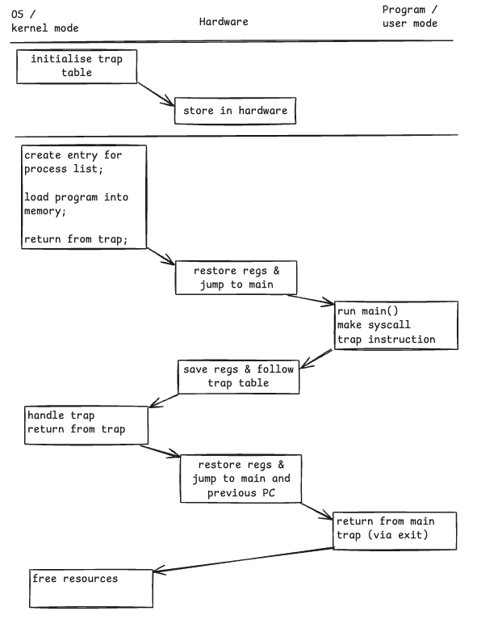
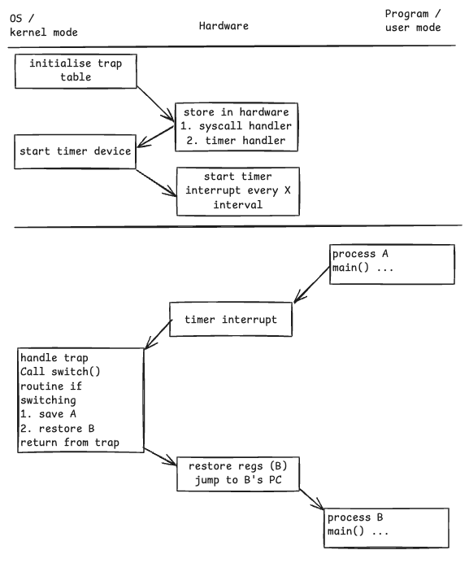

# Introduction
Before diving into defining what the term means, we need to be familiar with how a process gets executed on the CPU, and what are the problems when we attempt to implement **time sharing** between different processes.

If we assume there's only one process, a naive technique would be just a *direct execution*, where we run the program directly on the CPU. The OS may perform the following
1. create entry for process list
2. allocate memory and load program into memory
3. set up stacks
4. clear CPU registers
5. execute **`main()`**

the control will be handed to the program, which now runs on the CPU until it executes **`return`** from **`main()`**.

Then, the OS will free the memory used and remove it from the process list.

This simple approach gives rise to a few problems
1. how can the OS make sure the program doesn't do anything that we want it to do, while still running it efficiently?
2. how can the OS stop the running process halfway, and switch to another process?

The answers to the above questions help us identify what's needed to virtualise the CPU, and while developing these techniques, we can see where does the "limit" in limited direct execution comes from.
## Problem - Restricted Operations
Direct execution is fast, but what if the process wishes to perform some kind of restricted operation, such as issuing an I/O request, or gaining access to more system resources? The objective here is to give processes the ability to perform these operations without giving them the complete control over the entire system.

The approach here is to introduce a new processor mode - the **user mode**. Programs in the **user mode** is restricted in what it can do.

If a program wants to perform more restricted operations, it has to switch to the **kernel mode**.

To enable this special mode, all modern hardwares provide programs the ability to make a **system call**. These system calls expose a limited set of functionalities to user programs.
### about `TRAP`
System calls will be translated into the special `TRAP` instruction. When a program executes a trap instruction, the current program's state is saved, and the CPU jumps to the OS service routine associated with the trap number.

This is done by setting up a **trap table** - the OS informs the hardware of the locations of **trap handlers**, the hardware stores the location of these handlers until the machine is rebooted.
### system calls
We cannot allow calling program to access OS via direct addressing as it will allow malicious program to call **any code** in the OS. Instead, a **system-call number** is assigned to each system call. The OS will examine this number, ensures that' it is valid, and execute the corresponding code. This indirection serves as a protection against program invoking any OS routine by specifying the memory address.
### visualising protocol

## Problem - Process Switching
In the above simple model of direct execution, the process is running on the CPU. As the process is the sole occupant of the CPU resource, the OS isn't running and it can't execute swap out the process. Essentially, the problem is about how can the OS regain control of the CPU.

There are two approaches in doing so
1. cooperative - leaving the process to initiate system call to swap itself out
2. non-cooperative - OS takes control to swap

### Cooperative - process self swap
With this approach, the OS entrusts the process to be self aware that it's running for too long, and periodically give up the CPU so that OS can be executed on the CPU, and decide which task to run next.

We may think processes are going to be greedy and not give up control easily, but from the earlier **system call implementation**, a process gives the control to the OS quite frequently whenever it makes a system call. The process also gives control to OS when it triggers some panic conditions, such as dividing by zero, or accessing memory it should not access. These also generate a `trap` to the OS.

However, this does not account for malicious programs or bugs to spin in infinite loops that do not trigger any `trap` instruction. The only way to get out of this situation is to reboot.
### Non-Cooperative - OS controls
The answer to enforcing OS control requires hardware support - a **timer interrupt**. A timer device can be programmed to raise an interrupt every **x** milliseconds. When this interrupt is raised, the currently running process is halted, and a pre-configured interrupt handler in the OS runs.

> **interrupt vs trap**: an interrupt is a signal sent to the CPU by external hardware / internal components, `trap` is a special software generated interrupt due to system call or error

The OS then regains control from the CPU, and thus can stop the process and start a different one.

Since the hardware must know which code to run when the timer interrupt occurs, this mapping is also populated during boot time. Second, the OS must start the timer during boot time. Once the timer has begun, it is safe for OS to release control as the control will eventually return to the OS.
### Saving and Restoring Context
When the OS regains control, it has to decide whether to continue running the current process, or switch to a different process. This decision is made by the scheduler.

If the decision is to switch, the **context switch** code is executed, where the OS has to save a few register values and restore a few for the replacing process. By doing so, the OS ensures when `trap` instruction returns, the system picks up from the replacing process.
### Visualising processing switch with timer

## Concurrency
As we expect interrupts to be random events - how to we handle two interrupts are sent at the same time? One simple technique OS might do is to **disable interrupt** during interrupt processing. OS may also employ more sophisticated **locking** to protect concurrent access to internal data structures. More details are discussed in the concurrency chapter.
## Hands-On
(WIP)