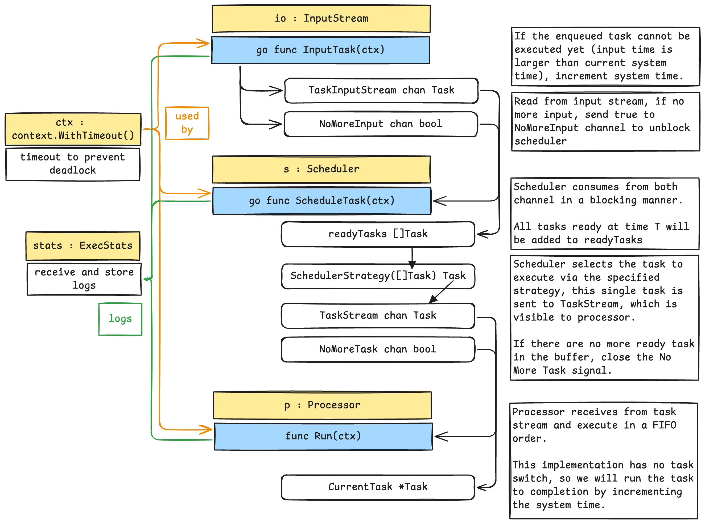

# Introduction
The best way to understand how scheduler works is to implement our own scheduler and processor simulation ([Source Code On Github](https://github.com/isbobby/system-programming/tree/main/go/os/scheduling))!.

The following details my attempt to implement scheduler simulation with three components
1. Input Stream - represents IO
2. Scheduler - maintains a buffer of ready tasks, apply scheduling strategy to choose a task, and schedule it for execution
3. Processor - wait for scheduler to schedule and execute tasks

Some other important constructs are
1. `ctx context.WithTimeout()` the same context is propagated across different go routines to help identify deadlocks.
2. `var systemTime atomic.Int32` is used to synchronise task timing across the routines
3. `var ExecStats` help with logging and visualisation.

## Code Design

## Todo
Current implementation needs the following improvement
1. Calculate response time in addition to turnaround time
2. Verify if the existing architecture can support task switching
