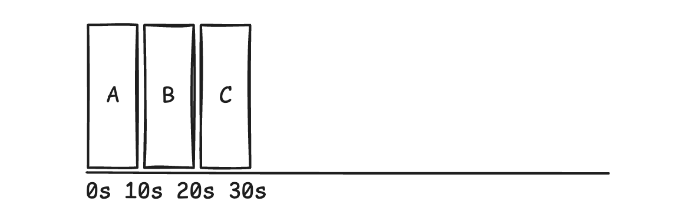
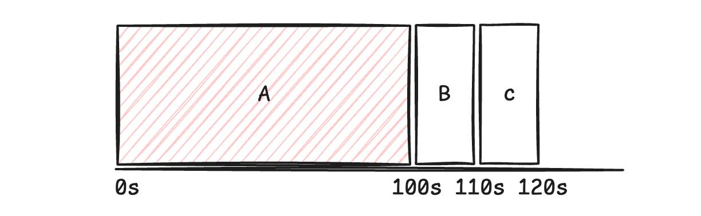

# FIFO Scheduling
The most basic scheduler algorithm, we execute workload by the order of their arrival. It works well given our simple assumptions.

Supposed we have three jobs arriving at the same time $$t=0$$, and each job takes 10 seconds to complete, the average turnaround time would be just $$sum(10+20+30)/3=20s$$.



Now, if we relax assumption 1, where jobs have different runtime, and if job A runs for 100s, the average turnaround becomes $$sum(100+110+120)/3=110s$$. 



Although job B and C have the same runtime, their turnaround gets degraded. This is referred to as the **convoy effect**, where a number of shorter workloads gets queued behind a large workload.

# Implementation & Results
The implementation is simple, when the scheduler is about to schedule a task, it can sort its ready tasks by their input time, and execute the task with the earliest input time.

```go
var FifoScheduling SchedulingStrategy = func(readyQueue *[]Task) Task {
	if len(*readyQueue) == 0 {
		panic("cannot schedule on empty tasks")
	}

	old := *readyQueue
    // yes we can use heap
	sort.Slice(old, func(a, b int) bool {
		return old[a].InputTime < old[b].InputTime
	})

	task := old[0]
	for task.InputTime > int(systemTime.Load()) {
		systemTime.Add(1)
	}
	*readyQueue = old[1:]

	return task
}
```

The result also aligns with our expectation, the turn around time is bad when we have a long task at the head of our task queue. The below shows the turn around time when task 2 is a long task.
```
// Tasks
Task 1, input time 0, duration 10
Task 2, input time 1, duration 100
Task 3, input time 2, duration 10

// output copied from the go program
Exec Log: -------------------------------------------
[time:  0s][IO Stream] input task, taskID:1
[time:  0s][Scheduler] selected task, taskID:1
[time:  0s][Scheduler] scheduled task, taskID:1
[time:  0s][Processor] starting task, taskID:1
[time: 10s][Processor] complete task, taskID:1
[time: 10s][IO Stream] input task, taskID:2
[time: 10s][IO Stream] input task, taskID:3
[time: 10s][Scheduler] selected task, taskID:2
[time: 10s][Scheduler] scheduled task, taskID:2
[time: 10s][Scheduler] selected task, taskID:3
[time: 10s][Processor] starting task, taskID:2
[time:110s][Processor] complete task, taskID:2
[time:110s][Processor] starting task, taskID:3
[time:120s][Processor] complete task, taskID:3
[time:120s][Scheduler] scheduled task, taskID:3
Exec Stats: -----------------------------------------
[Turn Around] 237 / 3 = 79.00s
```