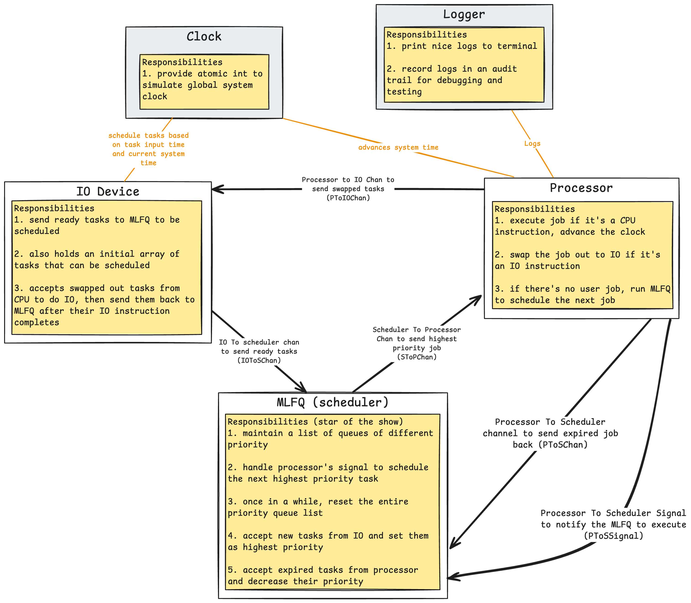

# Design Requirements
Using the MLFQ concepts listed from the previous [chapter](https://isbobby.github.io/2-os/2-scheduling/3-mlfq.html), we can start designing a MLFQ scheduler with these requirements

**Ready Queues**:
1. The MLFQ should contain multiple queus to hold ready jobs
2. Each queue has different priority and time allotment

**Scheduling**:
1. Scheduler should always schedule a job from the highest priority queue
2. Scheduler should apply round robin scheduling if there is more than one job
3. Scheduler needs to "reset" the system by moving everything back to highest priority queue to prevent starvation

**Job Swapping and Audit**:
1. We need to expire and swap out a task if its time allotment is up
2. Expired task has decreased priority
3. Since we are not implmenting an interrupt, we will delegate this to our logical processor
4. The logical processor needs to recognise if the next instruction is IO - if it is, it will send the job to the logical IO device

**Performing IO**:
1. We will have a logical IO device to perform IO instruction
2. This logical IO device will send ready jobs that have completed IO instructions back to MLFQ, waiting to be scheduled again

**Synchronisation with clock**:
1. A logical clock will be used to synchronise IO and CPU execution
2. This logical clock will send a signal to components subcribed every set duration

With these requirements, we can start off with 3 main components - `IO Device`,`MLFQ Scheduler`, and `Processor`. We should also include `Clock` and `Logger` to track the system time and perform structured logging.

With reference to the above diagram, we will enable inter-component communication with `go channel`, and rely on concurrent safe type provided by the `atomic` package to track system time.
