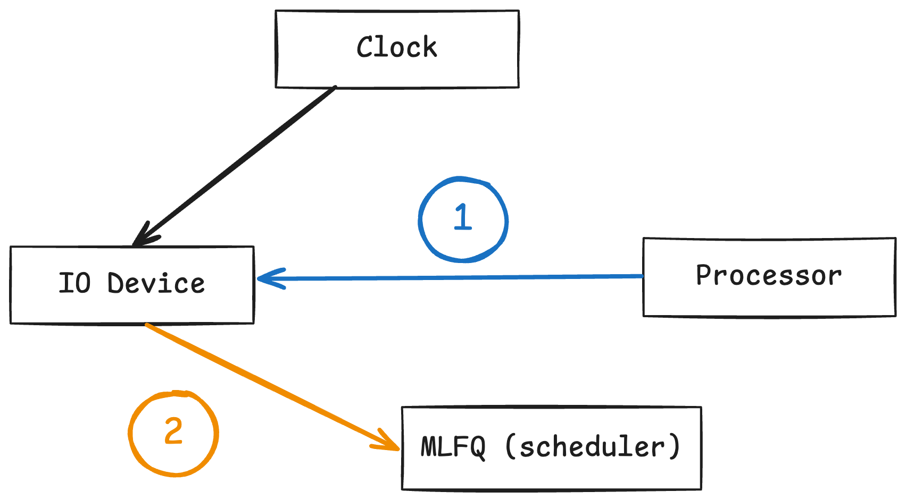

# Logical IO 
We will also implement an IO device which does the following
1. accept an incoming IO event based on the event time and current system time
2. accept a IO job from CPU and execute it based on the number of cycles
3. send a ready task to the scheduler

## Synchronisation with system time
To fulfill the above requirements, we will need to be in-sync with the system clock.

First, if a job is scheduled at `t=10`, we need to know that the current system time is `10` before we can send the job to the scheduler. We can store a reference to `systemTime *Clock`, and use `systemTime.Time.Load()` to read the current system time in a concurrent-safe manner.

Second, if a job is being executed and the IO instruction requires `N` clock cycles, we need to simulate IO execution by holding the job in the IO device until `N` cycles have elapsed. This can be done by storing a reference to `clockSignal <-chan`, every `<- clockSignal` execution represents on signal from our clock, and we can advance the instruction by one cycle.

```go
type IOStream struct {
    scheduledJobs []*Job
	systemTime    *Clock
	clockSignal   <-chan interface{}
}

// to read current system time
func (s *IOStream) currentTime() {
    s.systemTime.Time.Load()
}

// to handle clock signal
func (s *IOStream) handleSignal() {
    for {
        <-s.clockSignal
        // do something
    }
}
```

## Connection to other components
We will need different types of connections to scheduler and the processor.



The `IOStream struct` will accept jobs that require IO execution from the processor. This is indicated by the blue arrow (1). Normally there will be a device scheduler to further optimise IO executions, but in this simulation we will just do a serial execution in a FIFO manner.

Once a task has completed IO execution, or a new job has been created due to new input, we need to send this job the scheduler for it to be scheduled and executed on the CPU. This is represented by the orange arrow (2).

We will use two new go channels for the above communication. A buffered channel is chosen for `pToIOChan` because attempting to swapping out a job to the IO should be buffered and not block processor execution of the next job.

```go
// in init function
ioToSChan := make(chan *Job)
pToIOChan := make(chan *Job, 10)

type IOStream struct {
	scheduledJobs []*Job
	systemTime    *Clock
	clockSignal   <-chan interface{}

	ioToSChan   chan<- *Job
	pToIOChan   <-chan *Job
}
```

## Send input jobs to scheduler
The `IOStream struct` accepts an array of `*Job` during initialisation, we can simulate future inputs by adding `Job` to this queue. We will ensure this array is in an ascending order by job schedule time.

By polling `systemTime.Clock`, we can check if the job's schedule time is after the current time. If it is, we will schedule the job by sending it over the `ioToPChan`.

```go
func (s *IOStream) ScheduleInput(ctx context.Context) {
	sort.Slice(s.scheduledJobs, func(i, j int) bool {
		return s.scheduledJobs[i].ScheduledTime < s.scheduledJobs[j].ScheduledTime
	})

	for len(s.scheduledJobs) > 0 {
		job := s.scheduledJobs[0]
		s.scheduledJobs = s.scheduledJobs[1:]

		for job.ScheduledTime > int(s.systemTime.Time.Load()) {
		}

		s.logger.IOLog("input new job", "ID", job.ID)
		s.ioToSChan <- job
	}

	s.logger.IOLog("All jobs scheduled")
}
```

## Execute IO job
The `IOStream struct` also has the ability to handle new IO only job. Since all IO jobs are sent via the `pToIOChan`, we will use a separate go routine to poll from this channel in a non blocking way. 

Once a job is received, we will call `s.doIO()` on the job to perform IO.

We will also accept `<-ctx.Done()` as a timeout signal.

```go
func (s *IOStream) DoIO(ctx context.Context) {
	for {
		select {
		case job := <-s.pToIOChan:
			s.doIO(job)
		case <-ctx.Done():
			return
		default:
			continue
		}
	}
}
```

To execute a job, we will examine the instruction at the top of its instruction stack. If it is a CPU instruction, we will just send it back to the CPU via the scheduler.

Otherwise, we will execute the IO instruction for `N` clock cycles, which is determined by `cycle` attribute of the IO instruction.

```go
func (s *IOStream) doIO(job *Job) {
	s.logger.IOLog("received job from processor", "ID", job.ID)
	if len(job.InstructionStack) == 0 {
		s.logger.IOLog("received job from processor", "ID", job.ID)
		return
	}

	instruction := job.InstructionStack[len(job.InstructionStack)-1]

	if instruction.IsCPU() {
		s.logger.IOLog("job has CPU instruction, send back to scheduler", "ID", job.ID)
		s.ioToSChan <- job
		return
	}

	if instruction.IsIO() {
		s.logger.IOLog("job has IO instruction, executing", "ID", job.ID)

		cyclesRemaining := instruction.Cycle

		for cyclesRemaining > 0 {
			// note what if there's existing cycle signal
			s.logger.IOLog("run job IO", "ID", job.ID, "cycle left", cyclesRemaining)
			<-s.clockSignal
			cyclesRemaining -= 1
		}

		job.InstructionStack = job.InstructionStack[:len(job.InstructionStack)-1]

		if len(job.InstructionStack) > 0 {
			s.ioToSChan <- job
			s.logger.IOLog("job IO completed and sent to scheduler", "ID", job.ID)
		} else {
			s.logger.IOLog("job IO completed", "ID", job.ID)
		}
	}
}
```

## Summary
This logical IO device handles communication with various components via `go chan`, and perform job IO in a simple manner. Next, we will examine how the logical processor component is built.
