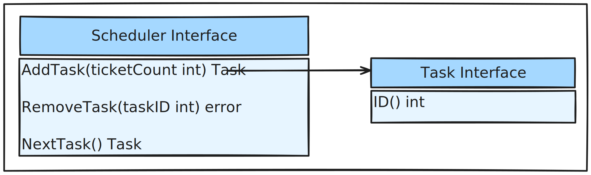

# Basic Lottery Scheduler Implementation
First, we start off with implementing a lottery scheduler that supports
1. tracking a list of tasks, and their lottery ticket count
2. adding and removal of tasks
3. updating the list of ticket count when tasks are added or removed

We will skip the following features in the basic implementation
1. tracking of local groups, and global and local ticket [currency conversion](https://isbobby.github.io/2-os/2-scheduling/4-fair_sharing.html#improvement---prevent-misallocation-of-resources)
2. [ticket inflation/deflation/transfer](https://isbobby.github.io/2-os/2-scheduling/4-fair_sharing.html#improvement---ticket-transfer)

This implementation also does not guarantee concurrency-safty.

## Design & Implementation ([Code Link](https://github.com/isbobby/system-programming/blob/main/go/os/scheduling/lottery/naive_lottery.go))


Three interface functions will be sufficient to support the basic requirement of a basic lottery scheduler. Internally, the scheduler maintains two key attributes
1. an array `sortedTaskList` ordered by task intervals to track the tasks.
2. an integer `maxTicketCount` tracking the total ticket given out

### **`AddTask(ticketCount)`**
`AddTask(ticketCount)` allows new tasks to be added, new tasks will be appended at the end of the `sortedTaskList` array. `maxTicketCount` will also be updated with `maxTicketCount += ticketCount`.

### **`RemoveTask(taskID)`**
`RemoveTask(taskID)` removes a task from the scheduler. The current implementation is an expensive linear operation.

This function first iterates the `sortedTaskList`  and removes the interval associated with the task. Then, all subsequent intervals are updated to keep the `sortedTaskList` sorted and compact. `maxTicketCount` will also be updated with `maxTicketCount -= removedTicketCount`.

### **`NextTask()`**
`NextTask()` first generates a random number with `go's` random number generator with `maxTicketCount` as the inclusive ceiling. Then, the corresponding task can be located with a binary search in the `sortedTaskList` interval.

### Improvements
`RemoveTask(taskID)` will likely be a bottleneck due to its `O(N)` complexity where `N` is the number of tasks. 

A different data structure to track the `sortedTaskList` may improve its complexity without degrading the performance of other functions (hint: tree/skip-list).

The need to adopt different internal storage implementation also exposed the tight coupling in the current code structure. The `sortedTaskList` type is a `[]intervalToTask` type, if we want to replace the underlying data structure, it requires extensive changes in all of the scheduler functions.
```go
type naiveLotteryScheduler struct {
	// auto-incrementing one based task ID
	lastId         int
	maxTicketCount int
	sortedTaskList []intervalToTask

	// tracks the number of scheduling per task
	scheduleAudit map[int]int

	logger logger
}

type intervalToTask struct {
	interval [2]int
	task     Schedulable
}
```

To remove this coupling, the `sortedTaskList` should be an `interface` which provides `Find(ticket)`, `Insert(task)`, and `Remove(task)` functions. This allows the underlying implementation to change freely without impacting the scheduler logic.
