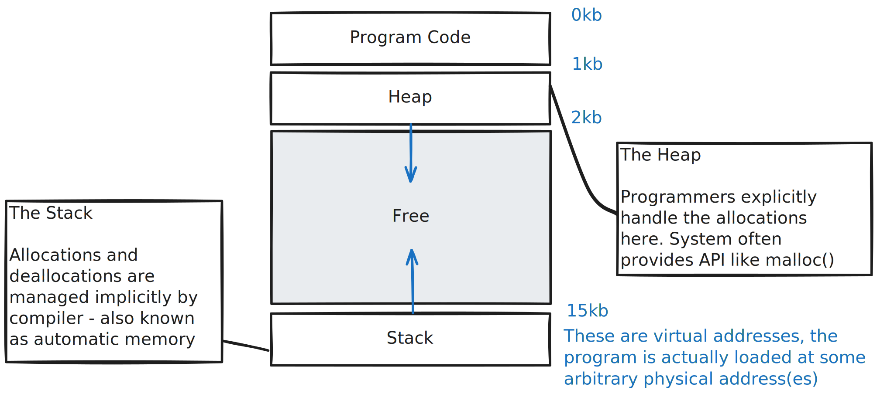

# Introduction
## Memory as an abstraction
CPU employs time sharing - it executes one process at a time, and swap it out to run the next. Various CPU scheduling policies aim to optimise this process.

What about memory? We could follow how CPU does it - load an entire program into memory and execute it one at a time. When we want to execute other programs, we persist the program state in disk, and repeat the process. The main issue with this approach was its poor performance.

This became a driver for memory sharing, where multiple programs can reside in memory at the same time. This yields better performance, but makes protection an important issue.

OS needs to provide an easy to use and safe interface to memory management. This abstraction over machine memory is called the **address space**, and it is the running program's view of memory in the system.

This address space of a process contains all of the memory states of a running program
1. the program's code, in the **instruction** area
2. the program's function calls chain and local variables in the **stack** area
3. the program's global variables, or dynamically allocated variables, in the **heap** area

The following is one simple way to structure a program's address space. We assume the **code** region is fixed (what about interpreted languages then?), and the **stack** and **heap** areas will change in size as the program runs. Hence, they are placed at opposite ends, and grows towards the empty region in the middle.

