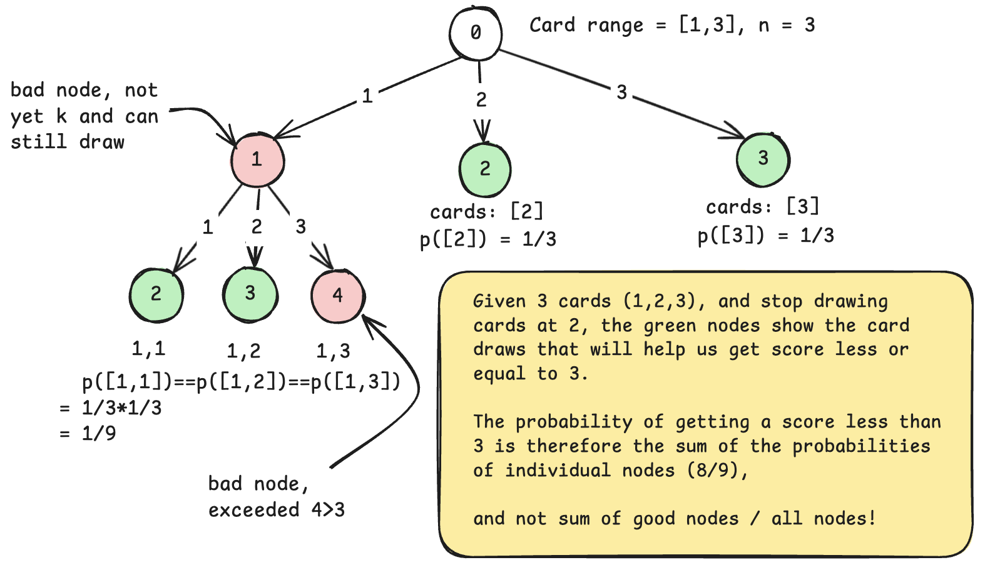
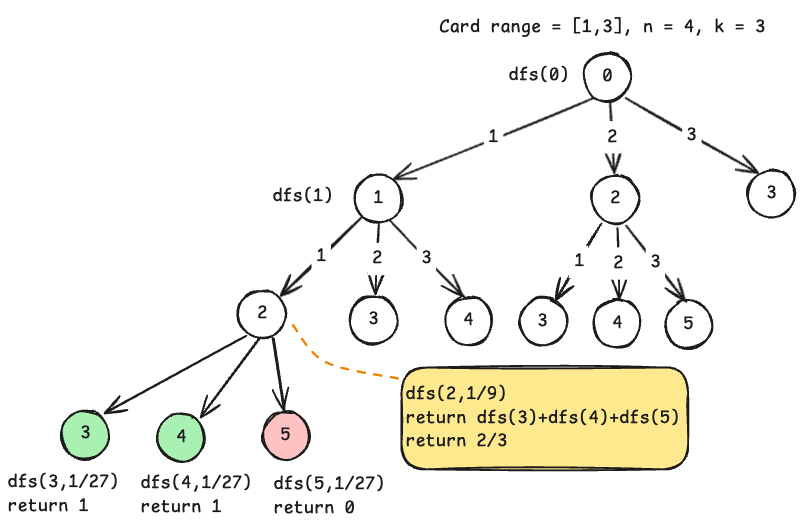
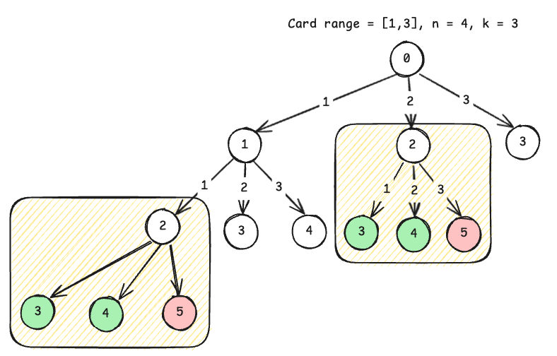
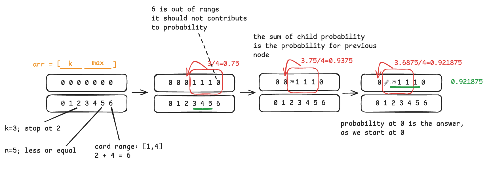

# New 21 Game ([Link](https://leetcode.com/problems/new-21-game/))
**Topics**: probability, tree, DFS, sliding window
## Description
We start with 0 points and draws numbers while we have less than $$k$$ points. During each draw, we gain an integer number of points randomly from the range $$(1, max)$$, where $$max$$ is an integer.

Each draw is independent and the outcomes have equal probabilities. We stop drawing numbers once we get $$k$$ or more points. We need to calculate the probability of getting less than $$n$$ points.


## Base Recursive Solution
First, we should consider what's a valid score. A score is valid if it's less than $$n$$. If a score is smaller than $$k$$, we continue drawing until it's larger than or equal $$k$$. Hence, a score should be counted towards the probability if $$ k \leq score \leq n$$.
```go
if curr >= k {
	if curr <= n {
		return 1
	}
	return 0.0
}
```

If the score is not larger than $$k$$, we need to draw more cards and expand the tree. The decision tree has a branching factor of $$max$$.

Once we have explored all the children at a node, we can sum their probabilities up. This sum is the probability of getting a score less than $$n$$ **if we started drawing cards this node, at the current level**, as shown by the code and diagram below.

```go
childProbSum := 0
for i := 1; i < max; i ++ {
	childProbSum += dfs(curr+i)/float64(max)
}
return childProbSum
```



## Optimal Substructure
Each node in the tree represents the probability of getting a *good score* that's larger or equal $$k$$ and smaller or equal $$n$$. The global solution can be found by summing the result of all sub-trees.

## Overlapping Subproblem
As we explore different nodes in the recursion tree, we will definitely encounter nodes sharing the same value. For example, the two highlighted subtrees have identical structure.



Instead of recomputing the same problem, we can store the result for **score=2** in a cache, and return the probability straight away next time we encounter the same node.

```go
baseChildProbSum := 0.0
for i := 1; i <= maxPts; i++ {
	baseChildProbSum += dfs(curr+i)/float64(maxPts)
}
memo[curr] = baseChildProbSum
```

The complete DFS solution will be
```go
func new21Game(n int, k int, maxPts int) float64 {
	cache := map[int]float64{}
	var dfs func(curr int) float64
	dfs = func(curr int) float64 {
		if curr >= k {
			if curr <= n {
				return 1
			}
			return 0.0
		}
		if prob, exists := cache[0]; exists {
			return prob
		}
		baseChildProbSum := 0.0
		for i := 1; i <= maxPts; i++ {
			baseChildProbSum += dfs(curr+i) / float64(maxPts)
		}
		cache[curr] = baseChildProbSum
		return baseChildProbSum
	}
	return dfs(0)
}
```

## Sliding Window Improvement


The DFS solution starts the search from `0`, this results in multiple visits to the same score despite memoization (we only return early, but still visit the node).

Instead, the solution can be further optimised with a sliding window, where we populate the base cases first: score that are larger or equal `k`. We can populate these score first because they have no children, because we cannot draw if the score is larger or equal `k`.

In the above DFS solution, the probability of a score is the sum of the child probability divided by `max`, this logic can be done by summing the window and dividing the sum, then assigning to the score (shown in red boxes). This greatly reduces the time complexity down to just $$O(k+max)$$.

```go
func new21GameSW(n int, k int, maxPts int) float64 {
	probs := make([]float64, k+maxPts)
	// fixed window of maxPts
	var curr int
	prob := 0.0
	for i := range maxPts {
		curr = len(probs) - i - 1
		if curr <= n {
			probs[curr] = 1
			prob += 1
		} else {
			probs[curr] = 0
		}
	}
	curr -= 1

	nextProb := prob / float64(maxPts)
	for curr >= 0 {
		probs[curr] = nextProb
		prob = prob - probs[curr+maxPts] + probs[curr]
		nextProb = prob / float64(maxPts)
		curr -= 1
	}

	return probs[0]
}
```