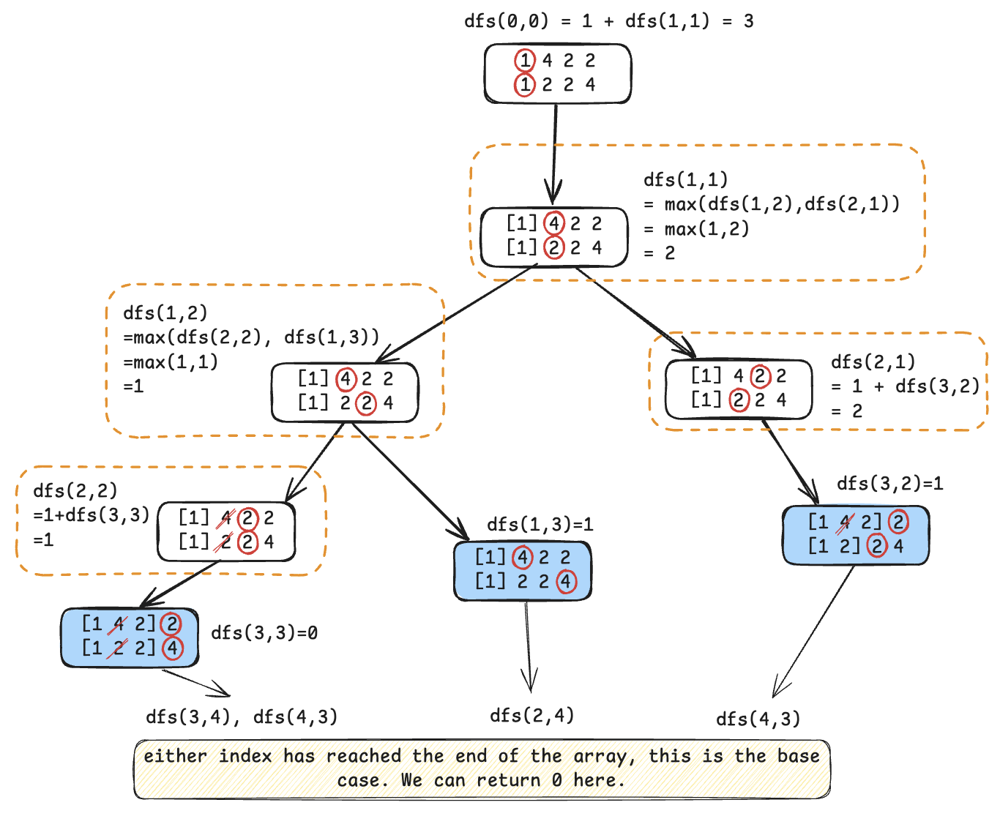

# Uncrossed Lines ([Link](https://leetcode.com/problems/uncrossed-lines/))
**Topics**: tree, DFS, DP
## Description
Given two integer arrays, find the maximum number of *non-intersecting lines* between these arrays. We can connect **two same elements** with a line. For example, the following will have 3 lines. We cannot connect `4-4` because it will block `2-2` connections.
```
1 2 2 4
|  \ \
1 4 2 2
```

## Optimal Substructure
Given two arrays $$l_1, l_2$$, which have lengths $$m,n$$. The optimal solution for the max connection can be defined as $$dp(S_1(l_11,l_12...l_1m), S_2(l_21,l_22...l_2n)) = dp(l_1,l_2)$$, where we consider the entire $$l_1$$ and $$l_2$$.

We observe that if $$l_{11} = l_{21}$$, then the optimal solution can be represented as

$$1 + dp(S_1(l_12...l_1m), S_2(l_22...l_2n))$$

If $$l_{11} \neq l_{21}$$, then we can choose $$l_{12}$$, or $$l_{22}$$ as the next element, the optimal solution can then be represented as

$$
\begin{aligned}
dp(l_1, l_2) & = max(\\
& dp(S_1(l_{11}...l_{1m}), S_2(l_{22}...l_{2n})), \\
& dp(S_1(l_{12}...l_{1m}), S_2(l_{21}...l_{2n})), \\
& )
\end{aligned}
$$



The same recurrence relation can also be represented with a 2D integer array.


## Overlapping Subproblem
We may visit the same `i,j` multiple times, when we do encounter the same `i,j`, we can refer to the cached value in `dp` and return early.

## Solution
DFS with a cache:
```go
func memo(nums1, nums2 []int) int {
	dp := map[[2]int]int{}
	var dfs func(i, j int) int
	dfs = func(i, j int) int {
		if i >= len(nums1) || j >= len(nums2) {
			return 0
		}
		if val, exists := dp[[2]int{i, j}]; exists {
			return val
		}
		if nums1[i] == nums2[j] {
			dp[[2]int{i, j}] = 1 + dfs(i+1, j+1)
		} else {
			dp[[2]int{i, j}] = max(dfs(i+1, j), dfs(i, j+1))
		}
		return dp[[2]int{i, j}]
	}
	dfs(0, 0)
	return dp[[2]int{0, 0}]
}
```

Iterative with a 2D table:
```go
func dp(nums1, nums2 []int) int {
	dp := make([][]int, len(nums1)+1)
	for i := range dp {
		dp[i] = make([]int, len(nums2)+1)
	}
	for i := 0; i < len(nums1); i++ {
		for j := 0; j < len(nums2); j++ {
			dp[i+1][j+1] = max(dp[i][j+1], dp[i+1][j])
			if nums1[i] == nums2[j] {
				dp[i+1][j+1] = max(dp[i+1][j+1], 1+dp[i][j])
			}
		}
	}
	return dp[len(nums1)][len(nums2)]
}
```