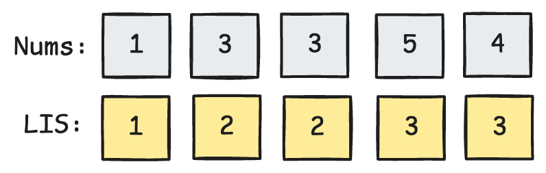
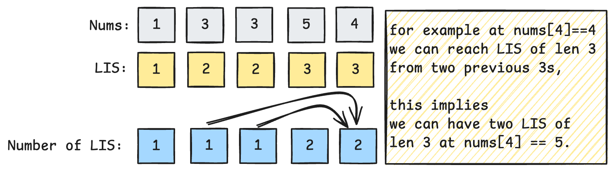

# Number of Longest Increasing Sub-Sequence ([Link](https://leetcode.com/problems/number-of-longest-increasing-subsequence))
**Topics**: array, sort, DP

## Warm up with LIS
We can review the question *Longest Increasing Sub-Sequence* as a warm up.

Given an integer array, we want to find the length of the longest increasing subsequence ([link](https://leetcode.com/problems/longest-increasing-subsequence/description/)).

For example, the longest subsequence of 
```
arr = [10,9,2,5,3,7,101,18]
LIS =       ^   ^ ^  ^ (4)
```

For this problem, the optimal substructure can be defined as: given an array of length $$N$$, the longest subsequence $$dp(N)$$ will be $$Max(dp(i))+1$$ where $$i=0,1...N-1$$ **if** the element at $$i$$ is smaller than element at $$N$$. If no such element exists, then $$dp(N)=1$$ (element itself).

We can store the longest increasing subsequence up to $N$ to prevent re-computation. We can refer to the following example to see how the intermediate results are used to give the final solution.
```
arr = [10,9,2,5,3,7,101,18]
dp  = [1, _,_,_,_,_,_  ,_] // at 10
dp  = [1, 1,_,_,_,_,_  ,_] // at 9
dp  = [1, 1,1,_,_,_,_  ,_] // at 2
dp  = [1, 1,1,2,_,_,_  ,_] // at 5, 2 is smaller
dp  = [1, 1,1,2,2,_,_  ,_] // at 3, 2 is smaller
dp  = [1, 1,1,2,2,3,_  ,_] // at 7, 5/3 is smaller
dp  = [1, 1,1,2,2,3,4  ,_] // at 101, 7 is smaller
dp  = [1, 1,1,2,2,3,4  ,4] // at 18, 7 is smaller
```

The code is simple with DP. We can further optimise the solution from $$O(N^2)$$ to $$O(N log(N))$$ with binary search, but that's another approach.
```go
func lengthOfLIS(nums []int) int {
    dp := make([]int, len(nums))
    res := 1
    for i := range nums {
        dp[i] = 1
        
        for j := 0; j < i; j ++ {
            if nums[i] > nums[j] {
                dp[i] = max(dp[i], dp[j]+1)
                res = max(res, dp[i])
            }
        }
    }
    return res
}
```

# Number of LIS
Let's consider the following array `[1,3,3,5,4]`. We can use the previous approach to calculate the LIS value for each node, as shown below.



From here, it is easier to formulate the bottom up logic. 

If a previous number is smaller, we can consider the LIS starting from this previous number - by updating the **LIS length**. 

In addition, we also need to track cases where the **LIS length is the same** with an `previousLisLen + 1 == currMaxLisLen` condition. 

Compare the following with the LIS solution above to see the differences.

```go
currMaxLisLen := 1
currLisCount := 1

// we can consider incrementing LIS
if previousNumber < currNumber {
	// update LIS if the IS starting from this number is largest
	if previousLisLen + 1 < currMaxLisLen {
		currMaxLisLen = previousLisLen + 1
		currLisCount = previousLisCount
	
	// add to number of LIS count if the length is the same
	} else if previousLisLen + 1 == currMaxLisLen {
		currLisCount += 1
	}
}	
```
Running this through all elements we have computed will yield the following result



However, this is not the completed result yet. This is because we can generate a total of **4** increasing subsequences of length 3 (`{1,3,5},{1,3,5},{1,3,4},{1,3,4}` there are two 3s). 

We can compute the final result with one pass to sum up LIS count of the maximum length. This gives us the final solution. I used a `[2]int{}` to represent the DP solution at `i`, but using a `type LIS struct` could make the code readable.

```go
func findNumberOfLIS(nums []int) int {
	dp := make([][2]int, len(nums)) // [0] represents max LIS len, [1] represents LIS count
	for i := 0; i < len(nums); i++ {
		dp[i] = [2]int{1, 1}
		for j := 0; j < i; j++ {
			if nums[j] < nums[i] {
				if dp[i][0] < dp[j][0]+1 { // if LIS from j is longer
					dp[i][0] = dp[j][0] + 1
					dp[i][1] = dp[j][1]
				} else if dp[i][0] == dp[j][0]+1 { // if LIS from j has same length
					dp[i][1] += dp[j][1]
				}
			}
		}
	}

	longest := 0
	res := 0
	for _, lis := range dp {
		if lis[0] > longest {
			longest = lis[0]
			res = lis[1]
		} else if lis[0] == longest {
			res += lis[1]
		}
	}
	return res
}
```