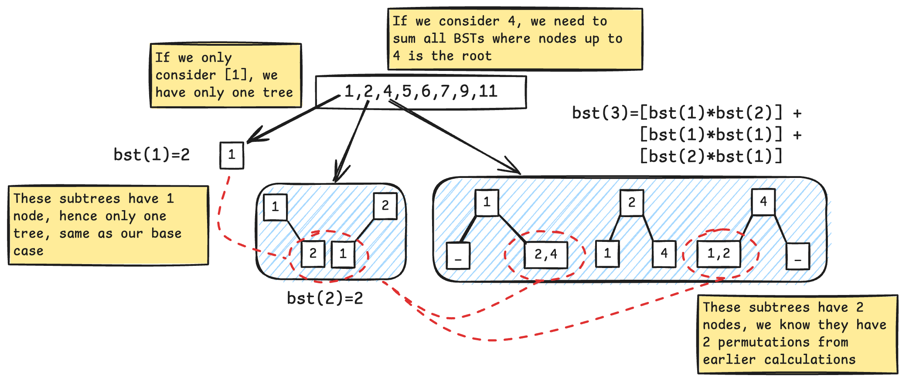

### Unique Binary Search Tree
This cateogry of problems revolves around the BST property that the same numerical array can be represented by BSTs of different structures (reminds me of high school organic chemistry, isomerism?).

For example, the array `arr=[1,2,3]` can be represented by these 5 structural unique binary search trees.
```
1       1      2        3    3
 \       \    / \      /    /
  2       3  1   3    2    2
   \     /           /      \
    3   2           1        1
```

### Q1 - Number of unique BSTs (DP)
Given an array, we want to find out how many **structurally unique validate binary search trees** we can generate.

Recursion is a natural way to represent tree structure and tree problems. We can model a valid binary search tree with the following partition
1. we choose element `arr[i]` as the root 
2. the left subtree will have `[0,i)` nodes
3. the right subtree with have `[i+1,n]` nodes

We will also need to define the base cases, if there is no node, or only one node, then there can be only one unique binary search tree.
```go
if n == 0 || n == 1 { // n is number of node
	return 1
}
```

The total number of unique binary trees is the sum of products of unique BSTs for the left and right subtrees, where number of unique BST with  `num := leftUniqueBst * rightUniqueBst`.

We can further explore the solution with the example below.



To represent it code, we will have the following solution
```go
func numTrees(n int) int {
    memo := make([]int, n+1)

    var dfs func(k int) int 
    dfs = func(k int) int {
        if k == 0 || k == 1 {
            return 1
        }

        if memo[k]!= 0 {
            return memo[k]
        }

        total := 0
        for i := 1; i <= k; i ++ {
            leftTrees := dfs(i-1)
            rightTrees := dfs(k-i)
            currentRootPermutations := leftTrees * rightTrees
            total += currentRootPermutations
        }
        memo[k] = total
        return total
    }

    return dfs(n)
}
```

The `dfs` approach allowed me to understand the recurrence relation of the problem, we can optimise by using a tabulation approach.
```go
func numTrees(n int) int {
	dp := make([]int, n+1)
	dp[0], dp[1] = 1, 1

    for i := 2; i < len(dp); i ++ {
        for j := 1; j <= i; j ++ {
            dp[i] += dp[j-1] * dp[i-j]
        }
    }

    return dp[n]
}
```

Running bench mark using go's `testing` library does show the tabulation approach is slightly faster (done on `n=100` with default `b.N`).
```
// BenchmarkBstMemo-10 81374 13229 ns/op 896 B/op 1 allocs/op
// BenchmarkBstTab-10 144045 8349 ns/op 896 B/op 1 allocs/op
```

### Q2 - Output All Unique BSTs
The problem requires us to output all unique BSTs instead of just returning the total number.