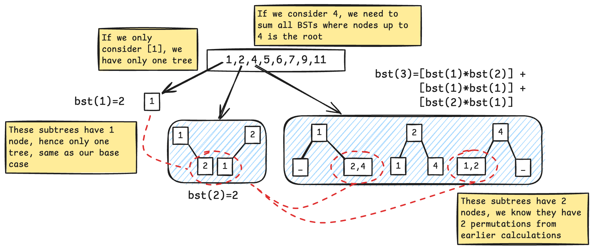
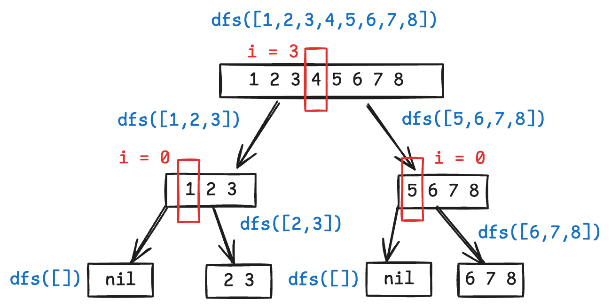

# Unique Binary Search Tree
This cateogry of problems revolves around the BST property that the same numerical array can be represented by BSTs of different structures (reminds me of high school organic chemistry, isomerism?).

For example, the array `arr=[1,2,3]` can be represented by these 5 structural unique binary search trees.
```
1       1      2        3    3
 \       \    / \      /    /
  2       3  1   3    2    2
   \     /           /      \
    3   2           1        1
```

## Q1 - Number of unique BSTs (DP)
Given an array, we want to find out how many **structurally unique validate binary search trees** we can generate.

Recursion is a natural way to represent tree structure and tree problems. We can model a valid binary search tree with the following partition
1. we choose element `arr[i]` as the root 
2. the left subtree will have `[0,i)` nodes
3. the right subtree with have `[i+1,n]` nodes

We will also need to define the base cases, if there is no node, or only one node, then there can be only one unique binary search tree.
```go
if n == 0 || n == 1 { // n is number of node
	return 1
}
```

The total number of unique binary trees is the sum of products of unique BSTs for the left and right subtrees, where number of unique BST with  `num := leftUniqueBst * rightUniqueBst`.

We can further explore the solution with the example below.



To represent it code, we will have the following solution
```go
func numTrees(n int) int {
    memo := make([]int, n+1)

    var dfs func(k int) int 
    dfs = func(k int) int {
        if k == 0 || k == 1 {
            return 1
        }

        if memo[k]!= 0 {
            return memo[k]
        }

        total := 0
        for i := 1; i <= k; i ++ {
            leftTrees := dfs(i-1)
            rightTrees := dfs(k-i)
            currentRootPermutations := leftTrees * rightTrees
            total += currentRootPermutations
        }
        memo[k] = total
        return total
    }

    return dfs(n)
}
```

The `dfs` approach allowed me to understand the recurrence relation of the problem, we can optimise by using a tabulation approach.
```go
func numTrees(n int) int {
	dp := make([]int, n+1)
	dp[0], dp[1] = 1, 1

    for i := 2; i < len(dp); i ++ {
        for j := 1; j <= i; j ++ {
            dp[i] += dp[j-1] * dp[i-j]
        }
    }

    return dp[n]
}
```

Running bench mark using go's `testing` library does show the tabulation approach is slightly faster (done on `n=100` with default `b.N`).
```
// BenchmarkBstMemo-10 81374 13229 ns/op 896 B/op 1 allocs/op
// BenchmarkBstTab-10 144045 8349 ns/op 896 B/op 1 allocs/op
```

## Q2 - Output all unique binary search trees
This is an extension to the above problem, instead of just outputting the number of unique BSTs, we want to return the roots to all structurally unique BSTs.

Given `arr=[1,2,3]`, we should output the root to the following trees
```
Output: [[1,null,2,null,3],[1,null,3,2],[2,1,3],[3,1,null,null,2],[3,2,null,1]]
1       1      2        3    3
 \       \    / \      /    /
  2       3  1   3    2    2
   \     /           /      \
    3   2           1        1
```

This requires a modification to the recursive solution we did previously. Instead of just summing, we need to visit all possible choices.

The base case will be the same - no nodes, and just one node.
```go
if len(nodes) == 0 {
	return []*Node{nil}
}

if len(nodes) == 1 {
	return []*Node{&Node{Val:nodes[0]}}
}
```

Note that we must return `return []*Node{nil}` when there's no nodes to choose from, as having `nil` child is also a valid permutation.

Next, we employ a divide and conquer approach, by recursively dividing the nodes into smaller subsets, until we reach the base case. This is done by continuously excluding the current node from the available nodes for selection, refer to the added code and diagram below.

```go
var dfs func(choices []int) []*Node{}
dfs = func(choices []int) []*Node{
	if len(nodes) == 0 {
		return []*Node{nil}
	}
	if len(nodes) == 1 {
		return []*Node{&Node{Val:nodes[0]}}
	}
	for i := 0; i < len(choices); i ++ {
		curr := choices[i]
		leftTreeNodes := choices[:i] // [0:i)
		rightTreeNodes := choices[i+1:] // [i+1:n)
		leftSubTrees := dfs(leftTreeNodes)
		rightSubTrees := dfs(rightTreeNodes)

		// construct left and right subtrees
	}
}
```


As we iterate through `choices`, we want to store and return all subtrees whose root is `choices[i]`. The subtrees are reconstructed at each recursive level and finally back to the root where `choices` is the entire array.

This logic is the same as what we did earlier - `currentPermutations := leftTrees * rightTrees`, we are iterating using a nested loop now since we need to construct the trees.

The following will be the complete DFS solution to the problem.

```go
func generateTrees(n int) []*TreeNode {
	var dfs func(choices []int) []*TreeNode

	dfs = func(choices []int) []*TreeNode {
		if len(choices) == 0 {
			return []*TreeNode{nil}
		}

		if len(choices) == 1 {
			return []*TreeNode{&TreeNode{Val: choices[0]}}
		}

        trees := []*TreeNode{}
        for i := 0; i < len(choices); i ++ {
            leftSubTreeChoices := choices[:i]
            rightSubTreeChoices := choices[i+1:]

            leftTrees := dfs(leftSubTreeChoices)
            rightTrees := dfs(rightSubTreeChoices)
            
            for _, leftTree := range leftTrees {
                for _, rightTree := range rightTrees {
                    newRoot := &TreeNode{Val: choices[i]}
                    newRoot.Left = leftTree
                    newRoot.Right = rightTree
                    trees = append(trees, newRoot)
                }
            }
        }
        return trees
	}
    choices := make([]int, n)
    for i := 0; i < n; i ++ {
        choices[i] = i+1
    }
    return dfs(choices)
}
```