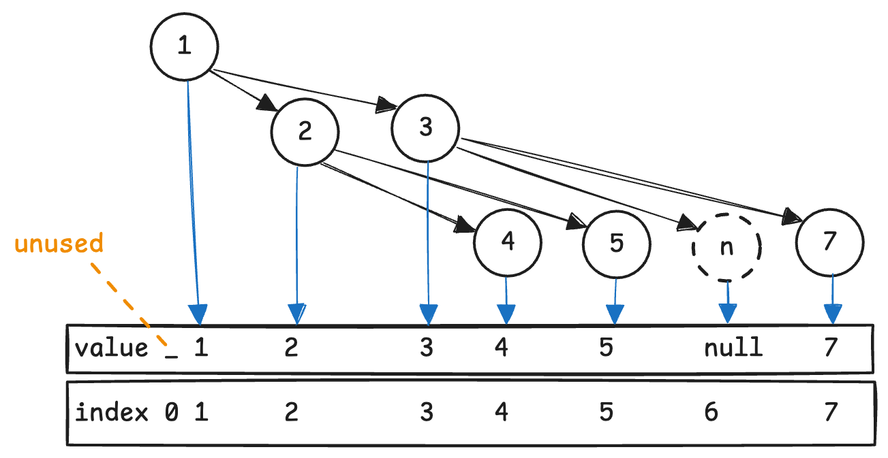
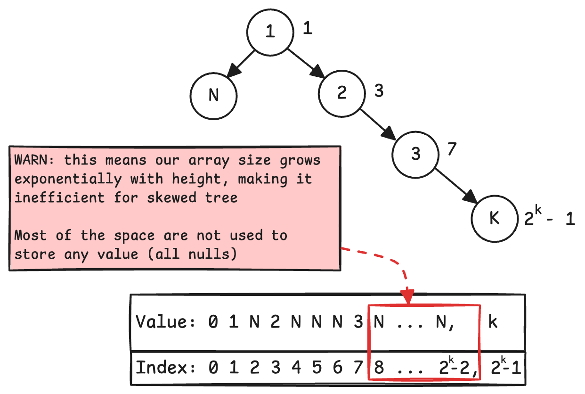
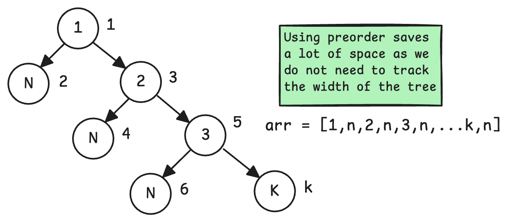
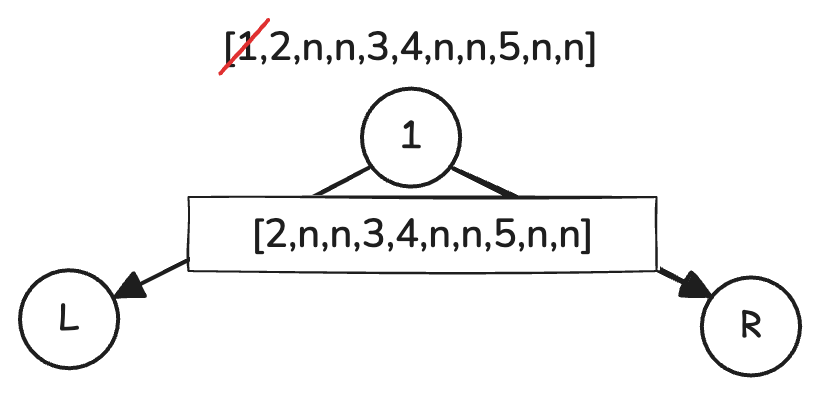
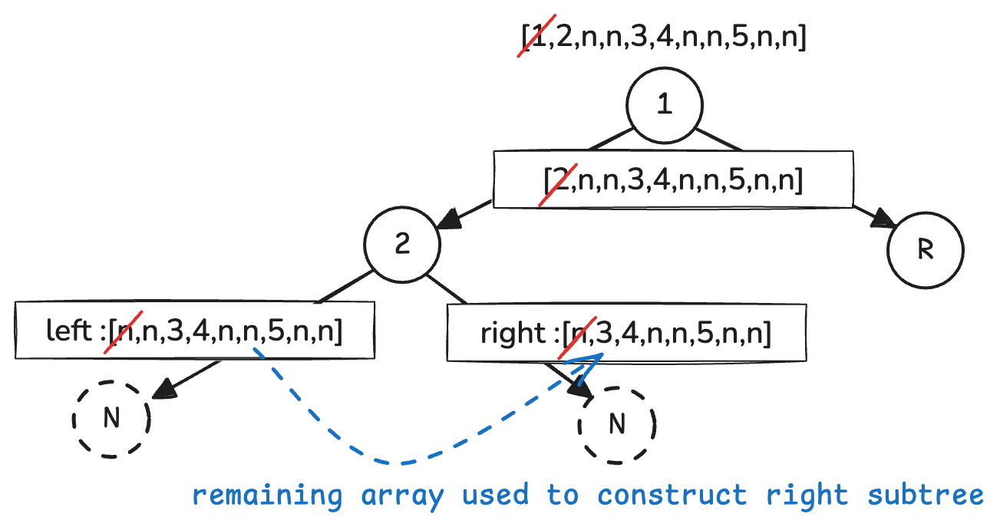

# Data Serialization
Also called *pickling*, *marshalling*, serialization is the process of translating a data structure's representation into a format that can be stored or transmitted.

For example, a tree can be represented as a nested structure with a `Node` structure with pointers to its left and right children.

A tree represented this way can be serialized into an integer array. An integer array is more convenient to be stored and transmitted. For example, we can use the following formulas to assign a node to a position in an array
```
root_index = 1
left_child_index = 2 * parent_index
right_child_index = 2 * parent_idnex + 1
```



We can also serialise a tree with pre-order, in-order, and post-order walks.

## Problem 1 - Serializing and Deserializing a binary tree ([Link](https://leetcode.com/problems/serialize-and-deserialize-binary-tree/description/))
### Serialising
I find the above serialization method is simple to understand, and deserialise from, however, it will incur a huge memory cost tracking `null` nodes if the tree is really skewed.



If we have a right skewed tree with 10 nodes, then we will need an array of size $$2^{10}-1=1023$$ to track the tree.

Hence, we need to find a more memory efficient way to track the tree. We have to maintain markers to represent the `null` children.

An alternative is to store the preorder walk of the tree, where we append the node first (hence pre-), then the left and right child.

```go
func serialize(root *TreeNode) string {
	var preOrder func(node *TreeNode)

	buf := []byte{}
	preOrder = func(node *TreeNode) {
		if node == nil {
			buf = append(buf, 'n')
			buf = append(buf, ',')
			return
		}

		numStr := strconv.Itoa(node.Val)
		buf = append(buf, []byte(numStr)...)
		buf = append(buf, ',')

		preOrder(node.Left)
		preOrder(node.Right)
	}
	preOrder(root)
	return string(buf[:len(buf)-1])
}
```

We can see the improvement in space usage, for a skewed tree, we need much less space to represent the tree.



### Deserialising
After a tree is serialised, we also need a function to reconstruct the tree into the original representation with `TreeNode`.

Pre-order walk will visit the root of a subtree first, so the head of an array will be the root of the current subtree, and the remaining array will form its left and right children.



After visiting the root, pre-order visits the left child. Hence, we know that the first element of the remaining array must be the root of the left subtree. If it's marked as `null`, we can return early. This happens as the left child of `2` is null.

According to how we do pre-order walk, we will finally visit the right node, and therefore `2` can use the "left over" array to build its right subtree.



With this understanding, we can use our `Preorder` DFS function to deserialise the tree.
```go
// construct a tree given vals, return the root and remaining unused vals
var Preorder func(vals []string) (*Node, []string)

Preorder = func(vals []string) (*Node, []string) {
    if len(tokens) == 0 {
        return nil, []string{}
    }

    if tokens[0] == "n" {
        return nil, tokens[1:]
    }

    num, _ := strconv.Atoi(tokens[0])
    currRoot := Node{
        Val: num,
    }

    leftSubTreeTokens := tokens[1:]

    leftSubTree, rightSubTreeTokens := preOrder(leftSubTreeTokens)
    rightSubTree, parentRightSubTreeTokens := preOrder(rightSubTreeTokens)

    currRoot.Left = leftSubTree
    currRoot.Right = rightSubTree

    return &currRoot, parentRightSubTreeTokens
}
```

To deserialise, we just need to do some tokenisation on the input string from earlier
```go
func (this *Codec) deserialize(data string) *TreeNode {
	tokens := strings.Split(data, ",")
	root, _ := preOrder(tokens)
	return root
}
```

The complexity will just be $$O(N)$$ where N is the number of nodes, since we only visit each node once with DFS.

## Problem 2 - Same thing, but on a BST ([Link](https://leetcode.com/problems/serialize-and-deserialize-bst/description/))
WIP