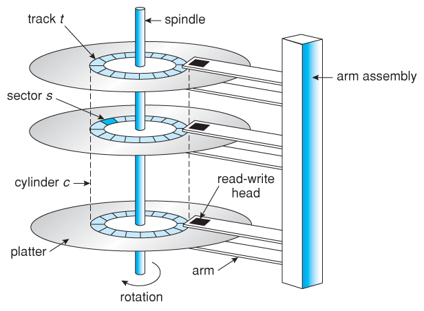

# Physical Components of a Database
Relational Databases are built on top of physical storage of data, more specifically magnetic disks. Unlike memory which we (application developers) are used to, magnetic disks have a few unique properties which set them apart from memory. We should be aware of these properties, as they will become key driver of some design decisions in DBMS.

## Magnetic Disks / Hard Disk Drives
### Storing Data
RAM is byte addressable and provides pretty good granularity in data storage. We can write individual bytes by specifying a memory address. The smallest unit of data is just one byte.

Magnetic disks are different, they are designed for bulk storage, and the smallest unit of data is a **sector**. A sector ranges from `512b`  to `4kb`.

### Reading and Writing Data
To read or write data from memory, we can simply read from or write to a memory address. This is because RAM is directly connected to the memory bus.

 In contrast, the CPU cannot access the address on disk directly from CPU. Instead, we need to find and fetch the sector containing the data into memory via the disk controller. 
 
 Once found, we will load the sector into memory and perform read or write by referencing the data's memory address. If we want to write data, we also need to write the entire sector.

### Construction & Mechanism
To understand the performance properties of a disk, we need to first understand the physical construction and mechanism.

With reference from the above [diagram](https://www.cs.uic.edu/~jbell/CourseNotes/OperatingSystems/10_MassStorage.html):
1. Disks are made up of platters and heads to do read and write
2. These platters can rotate, so the heads can read / write different sectors on the platter
3. The head can move in or out to read a different track on the platter
4. Only one single head can read and write at a time

This also makes the steps to read / write data quite clear
1. First, the arm has to move to the right track on the platter (seek time)
2. Then, the platter has to spin to the right sector (rotational delay)
3. Lastly, the data is transferred to RAM (transfer time)

Note that step 3 cannot be optimised, hence, we need to focus on minimising / eliminating seek time and rotational delay.

## Solid-State Drive
Flash memories can be combined to form solid state drives.

NAND Flash : fine grain reads (as compared to page), coarse grain writes! asymmetrical

Only 2k/3k erasures before failure - we cannot keep writing to the same cell and load balance the writes over the SSD

Write amplification - we need to write big units even if we want to just write a small thing, need to reorganise for wear and garbage collection.

Bottom line - read is fast, random read is also fast, sequential read is only slightly faster (differs from magnetic disks)

Write is slow for both random and sequential writes.

Flash is faster than disk, up to 10 times the bandwidth of an ideal hard disk. In fact, SSD can out perform even more for non-sequential read.

Locality matters for flash as well - magnetic disk needs to rotate to the right data location, whereas in flash, writing to two blocks far away from each other can trigger double write amplification.

## Comparison and Trends
### Relative Speeds
It's a common knowledge that disks are slow, but how slow?

As an analogy and ease of understanding, let's assume reading data from CPU takes `1s`. If we want to read from memory, it will take `100s`, around hundred times slower.

If the data sits on SSD, the process will take around `1.5` days, around `100,000` times slower than reading from registers.

Lastly, if the data sits in magnetic drive HDD, it takes `1.5` months to read the data.

### Cost
The reason why HDD is still so widely used today is because of its cost efficiency. We will see as soon as we compare their cost per `TB` of data.
1. RAM is the most expensive, coming at 2000 - 5000 USD per TB (2025 price).
2. SSD is much more efficient, with around 30 - 100 USD per TB.
3. HDD is the most cost efficient, costing only 10 - 30 USD per TB.

### Storage Pragmatics & Trends
Actually, many significant databases are not very big! They are in the range of hundreds of GBs.

But data sizes grow faster than Moore's law. One flight generates up to a TB of data per flight.

Trends: large DB are relative traditional and use magnetic disks, SSD do offer better performance and less variance

Smaller DB is changing much faster - RAM, NoSQL etc

What about changes to the hardware? we will worry about magnetic for sometime, but we must pay attention also to smaller rich datasets.
